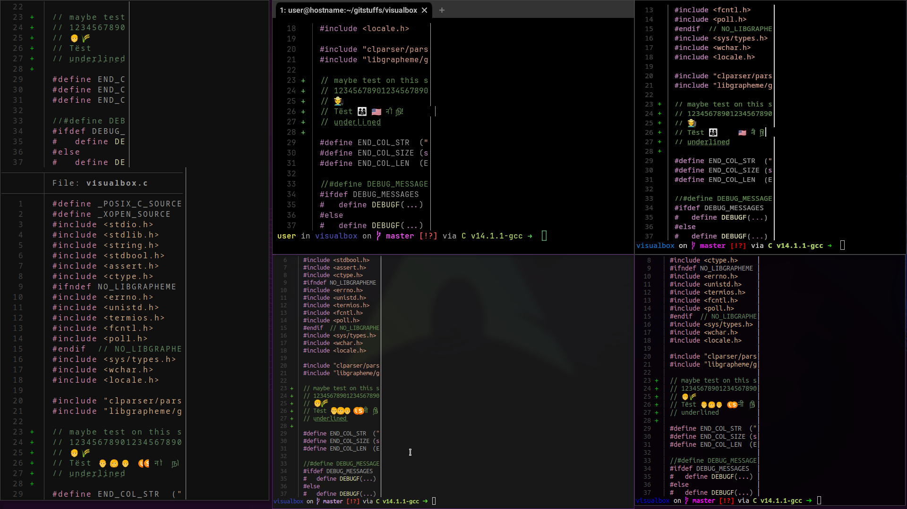

# visualbox
## Overview
- a simple utility to output formatted input with an exact (visual) width and height
    - the output is the same as the input except that the its lines and columns shown when outputted to a terminal are as given
- terminal color sequences are preserved and don't contribute to the width
    - other ANSI sequences are not handled and would break output
- emojis and other unicode wide characters will usually have the correct width
    - NOTE: cannot guarentee exact visual width because unicode character widths aren't handled consistently
    - libgrapheme is used to detect unicode grapheme clusters
    - terminal [ANSI mode 2027](https://github.com/contour-terminal/terminal-unicode-core) supported to detect if grapheme clusters should be used
- tabs are set to a width of 4 spaces by default
    - align to 4 space columns as expected
- considering utf-8 allows codepoints up to 6 bytes that can be 0-2 columns wide and clustered together with other codepoints to form new characters, this is more complicated than it seems
    - used somewhat standard C standard library functions `mbrlen`, `mbrtowc`, and `wcwidth` for unicode character width
    - used libgrapheme for grapheme cluster length
    - ANSI color escape sequences handled manually

## Usage
- Usage:
```console
$ visualbox --help
Usage:  visualbox [ --help|-h ] [ --no-mode-2027|-N ] [ --force-cluster|-f ] [ --file|-f file = - ] [ --tabs|-t tabs = 4 ] --width|-w|--rows rows [ --delim|-d delim = │ ] --height|-h|--columns columns [ file = - ] width height
file taken as positional argument
 [ --help|-h ]                                    Print this help message
 [ --file|-f file = - ]                           file to output (default stdin)
 --width|-w|--rows rows                           width of output (required)
 --height|-h|--columns columns                    height of output (required)
 [ --tabs|-t tabs = 4 ]                           number of spaces per tab
 [ --delim|-d delim = │ ]                         delimeter to print at end of line
 [ --force-cluster|-f ]                           force length to clustered grapheme
 [ --no-mode-2027|-N ]                            don't check if terminal can use clustering
```
- if file is omitted, then `visualbox` will read from `stdin`
- width and height are mandatory
    - width and height can be given as positional args if file is specified (use '-' for stdin)
- delim is an arbitrary string (default to │)
- tabs is an int of how many spaces tabs should amount to (default to 4)
- can also specify whether to force clustering or whether to skip check for if terminal supports clustering
### Use case
- I created this to use in my [bat-minimap](https://github.com/dfuehrer/system-scripts/blob/main/bat-minimap) script
    - I use this script for previewing text files in `lf`


- NOTE how it will look will depend on the terminal and how it renders unicode characters
    - for terminals that dont cluster unicode characters, the width will  be calculated correctly, but things will look weird
    - for terminals that do   cluster unicode characters, the width might be calculated correctly, but often won't be
        - in this example, the U and S emojis making up the flag are reported as having a width of 1 from `wcwidth`, so the flag is assumed to have 1 width when clustered, even though all of those emojis should have width 2

## Building
- relies on clparser submodule
    - builds statically against clparser/libparseargs.a
- relies on libgrapheme submodule
    - builds statically against libgrapheme/libgrapheme.a
    - if undesired, grapheme support can be easily removed by building with `NO_LIBGRAPHEME=1` make option
        - see config.mk
- build with `make(1)`
- install with `make install`
    - installs locally to ~/.local/bin by default
    - tweak the directories in config.mk to choose where it gets installed
